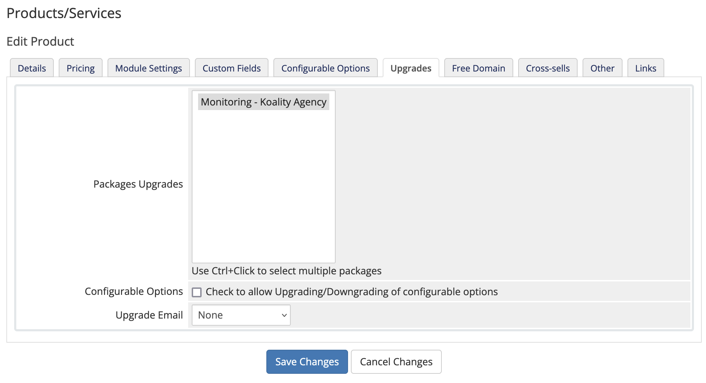

# Koality WHMCS provisioning module

## Description

TBD

## Koality Plans

The module supports the following Koality plans:

|                                | Personal | Business | Agency |
|--------------------------------|----------|----------|--------|
| Number of monitored projects   | 1        | 1        | 30     |
| Number of monitoring areas     | 6        | 6        | 6      |
| Number of monitored pages      | 5        | 15       | 15     |
| Test interval                  | daily    | hourly   | hourly |
| Advanced e-commerce monitoring | no       | yes      | yes    |
| Full site checks               | yes      | yes      | yes    |
| Scheduled full site checks     | no       | yes      | yes    |
| Multichannel alerts            | no       | yes      | yes    |

In addition to the projects included in the plan, an additional amount of projects can be set in the product options.

## Requirements

The minimum required PHP version is 7.4.

For the latest WHMCS minimum system requirements, please refer to <https://docs.whmcs.com/System_Requirements>.

## Installation

* Download the latest zip archive from the [releases page](https://github.com/koality-io/whmcs-koality/releases)
* Extract the contents of the zip file in the WHMCS root directory; the module will be extracted to `/modules/servers/koality`
* Remove the zip file afterward

## Server setup

The module uses the Plesk Key Administrator Partner API 3.0. To configure the module, go to Products/Services -> Servers and add a new server with the credentials:


## Product setup

After server setup is done, go to Products/Services and add a new product group e.g. `Monitoring`. Then create a new product:


and configure it further in the Module Settings:


The `White label domain (application)` and `White label domain (license activation)` fields are optional and can be used to set the domain name for the white label monitoring URL. If the domain name is not specified, the default domains `koality.360monitoring.com` (application) and `license.360monitoring.com` (license activation) will be used.

The `Additional single projects` and `Additional 30 projects` fields are optional and can be left empty.

### Configurable Options

To allow the customer to choose additional projects (pay-as-you-grow model), go to the Configurable Options, and add a new group with two options inside, named `additional_single_projects|Additional single projects` and `additional_thirty_projects|Additional thirty projects` respectively and assign them to the relevant products.

It's required that the left side of the pipe in the option name remains untouched, but you can edit the right side as you like i.e. `additional_single_projects|Write your own product option name here`.


### Product upgrades/downgrades

You also can configure product upgrades, but it's only allowed to upgrade from a single plan to a higher plan (e.g. Business -> Agency). A downgrade from a higher plan to a lower plan (e.g. Agency -> Business) is restricted by the Plesk Key Administrator.



## Email template customization

The Koality license can be activated through the client area or by sending the activation link in the "New Product Information", which by default is the "Other Product/Service Welcome Email". To do so:

* Go to Configuration -> Email Templates
* Edit the "Other Product/Service Welcome Email" in the "Product/Service Messages" group
* Add the placeholder `{$service_custom_field_activationurl}` to the template, e.g.
```
{if isset($service_custom_field_activationurl)}If not already done please activate the product here: {$service_custom_field_activationurl}{/if}
```

## Troubleshooting

In case of problems look at the System Logs -> Module Log.

## Support

If you've any issues or need support, feel free to contact support-koality@360monitoring.com.

## Copyright

Copyright 2022. [Plesk International GmbH](https://www.plesk.com). All rights reserved.
